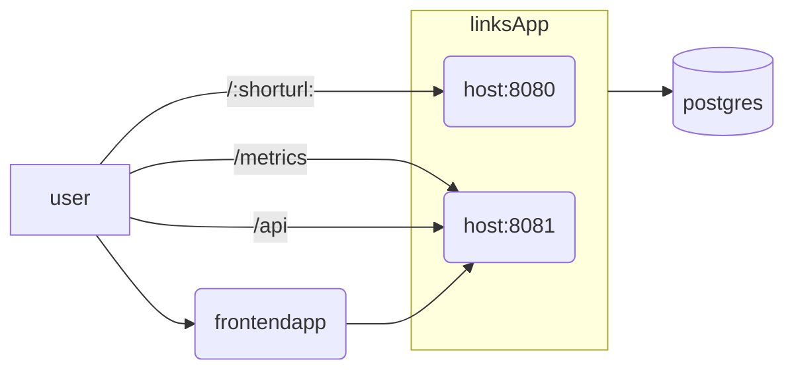

# links 
Human Redirector and admin portal. Similar to GoLinks and Trotto.

# Current Features 
- json api
- Inmem storage with hardcoded values!
- nextjs frontend admin portal
    - edit lints

# Planned features
- Okta SSO Integration
- postgres

# Architecture
